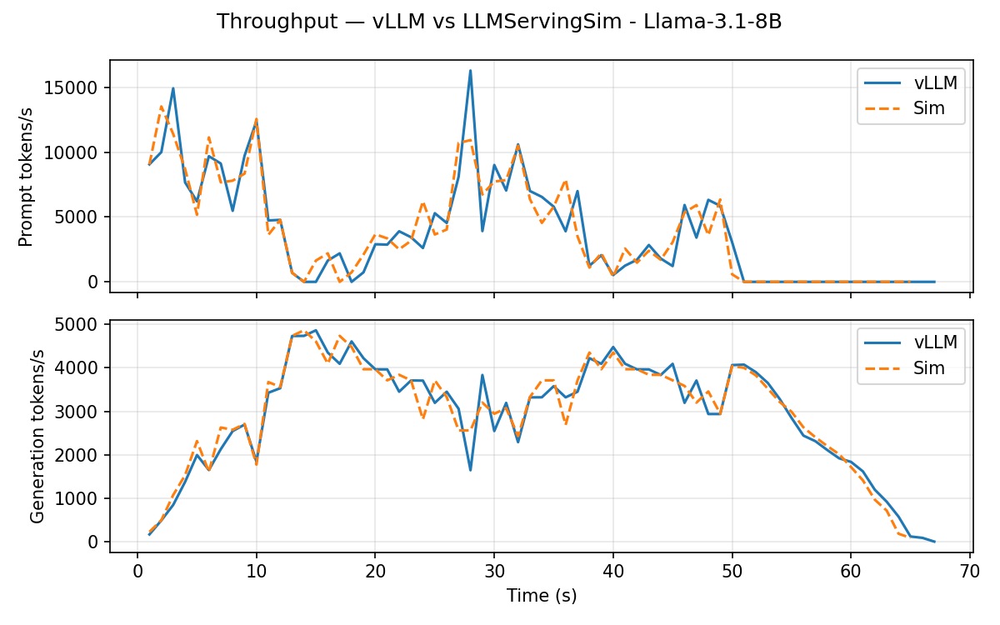
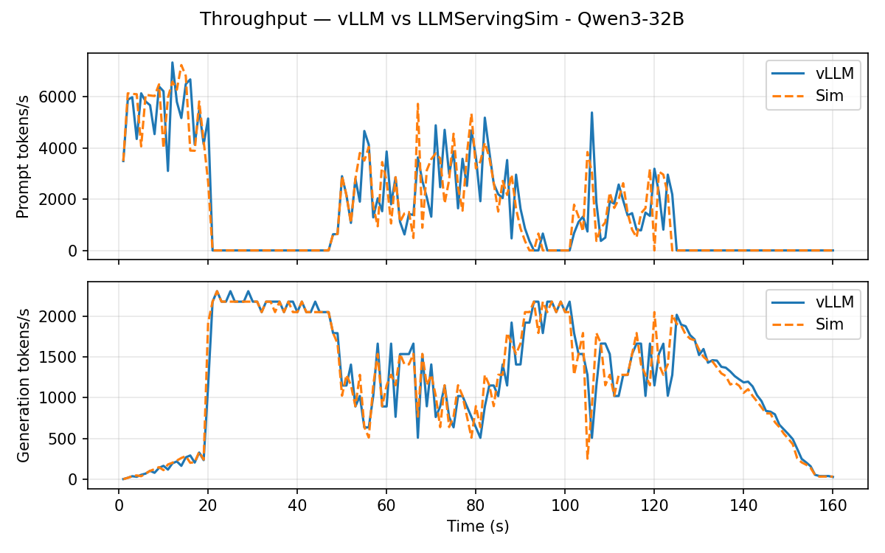
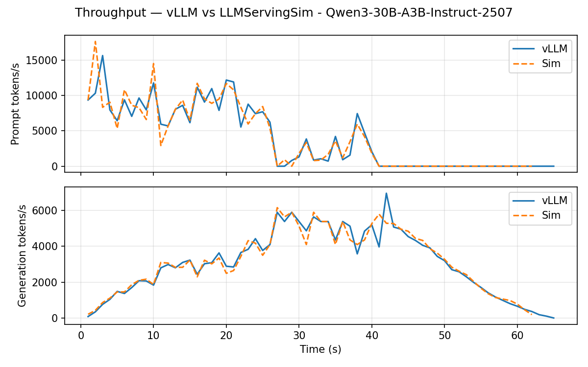

# LLMServingSim 2.0: A Unified Simulator for Heterogeneous and Disaggregated LLM Serving Infrastructure

## Current Release: **v1.0.1** (2026-04-26)

### Highlights

- New vLLM-based layerwise profiler (`profiler/`) capturing real CUDA kernel
  timings into per-category CSVs (base methodology adapted from
  [@waneon](https://github.com/waneon))
- Skew-aware attention: 5-axis weighted-LS alpha fit recovers the FlashAttention
  varlen penalty on heterogeneous-decode batches
- Multi-hardware support via the new profiler — RTXPRO6000 profiles included
- Per-rank MoE latency modeling with EP-aware routing, plus DP+EP via
  `tp_size`/`pp_size`/`ep_size`/`dp_group` cluster config
- DP+EP wave synchronization through ASTRA-Sim ALLTOALL with `involved_dim`
  dimension scoping on 2D topologies
- vLLM-style real-time request routing (`LOAD` policy)
- Agentic session support for closed-loop workloads (SWE-bench, tool-calling)
  with dependency chains across sub-requests
- Qwen3 model family (Qwen3-32B, Qwen3-30B-A3B MoE) with explicit `head_dim`
- FP8 KV cache simulation and profiling (`--kv-cache-dtype fp8`)
- Chunked prefill enabled by default, with per-request token cap
  (chunked prefill core by [@HyunsuYEE](https://github.com/HyunsuYEE))
- Non-Docker vLLM installer (`scripts/install-vllm.sh`)
  ([@junwha](https://github.com/junwha))
- End-to-end validation suite (`bench/`) comparing vLLM vs simulator on
  TTFT / TPOT / throughput / running-waiting
- Profiler `parser.parse_args()` fix (reported and fixed by
  [@junwha](https://github.com/junwha), [@gleb-kun](https://github.com/gleb-kun))
- Rich-backed logger shared between simulator and profiler with `success` /
  `summary` / `stage` / `progress` helpers
- Directory restructuring: `cluster_config/` → `configs/cluster/`, `model_config/` →
  `configs/model/`, `dataset/` → `workloads/`, `output/` → `outputs/`

> **Note:** This branch is under active development and may not be stable.  
> Bug fixes, feature additions, and all contributions via pull requests are welcome!

See full changelog [here](CHANGELOG.md).

## Repository structure

```
LLMServingSim/
├── serving/                # simulator core    (`python -m serving`)
├── profiler/               # vLLM-based layerwise profiler  (`python -m profiler`)
├── bench/                  # vLLM end-to-end benchmark + sim validation  (`python -m bench`)
├── workloads/              # JSONL workloads + ShareGPT generators  (`python -m workloads.generators`)
├── scripts/                # shared environment / build entry points
├── configs/                # cluster / model / PIM configurations
└── astra-sim/              # ASTRA-Sim C++ backend (submodule)
```

Each Python module has its own README under the directory; this file
covers the simulator-side workflow end-to-end. Per-paper artifact
evaluation scripts live on dedicated branches — see
[Evaluation](#evaluation) below.

## Build LLMServingSim

### 1. Git clone

```bash
git clone --recurse-submodules https://github.com/han-hyeonmin/LLMServingSim.git
cd LLMServingSim
```

### 2. Set up the environment

**Option A — Docker (recommended)**

The codebase ships with two container launchers, one per role:

| Container | Image | Purpose |
| --- | --- | --- |
| `scripts/docker-sim.sh`  | `astrasim/tutorial-micro2024` + Python deps | Run the simulator (`python -m serving …`) and ASTRA-Sim. |
| `scripts/docker-vllm.sh` | `vllm/vllm-openai:v0.19.0`                  | Run the profiler (`python -m profiler`), the benchmark (`python -m bench`), and dataset generation (`python -m workloads.generators`). |

```bash
./scripts/docker-sim.sh           # for simulation
./scripts/docker-vllm.sh          # for profiling / benchmarking / dataset gen
```

> **If using Docker**: `run_custom_pdd.sh` contains conda activation lines
> (`source .../conda.sh`, `conda activate servingsim`) at the top. These must be
> **commented out** when running inside Docker, as the Docker environment does not use conda.

A bare-metal installer for the vLLM side (`scripts/install-vllm.sh`)
is available for environments without Docker.

**Option B — conda (no Docker)**

```bash
conda env create -f scripts/servingsim.yml
conda activate servingsim
conda env create -f scripts/vllm-env.yml
conda activate vllm-env
```

### 3. Build ASTRA-Sim and Chakra

This will compile ASTRA-Sim (analytical backend) and install Chakra.

```bash
./scripts/compile.sh
```

## Run LLMServingSim

### 1. Set input configurations

All configurations for LLMServingSim are generated automatically by
`serving/core/config_builder.py` from a `cluster_config` file.

The `configs/cluster` file specifies node topology, instance layout, hardware type, memory
hierarchy, and interconnect parameters. It also supports per-layer placement rules for weights,
KV cache, and experts, as well as PIM-enabled device configuration.

**Config paths:**
- Cluster config: `configs/cluster/{config_name}.json`
- Logical topology config **(ns3 backend only)**: `astra-sim/inputs/logical_topology/{topology_name}.json`

**Dataset path:**
- Dataset: `workloads/{dataset_name}.jsonl`
- Runtime-generated traces: `astra-sim/inputs/trace/`

See `configs/cluster/` for example configurations and `configs/cluster/README.md` for the
configuration format reference.

### 2. Run LLMServingSim

Test run:

```bash
python -m serving \
    --cluster-config 'configs/cluster/single_node_single_instance.json' \
    --dtype float16 --block-size 16 \
    --dataset 'workloads/example_trace.jsonl' \
    --output 'outputs/example_single_run.csv' \
    --log-interval 1.0
```

See `serving/run.sh` for additional examples covering multi-instance, P/D disaggregation,
MoE, prefix caching, CXL memory, PIM, power modeling, and sub-batch interleaving:

```bash
./serving/run.sh
```


## Parameters of `serving/__main__.py`

The current version ships profile data for:

| Hardware | Models |
|----------|--------|
| RTXPRO6000 | `meta-llama/Llama-3.1-8B`, `Qwen/Qwen3-32B`, `Qwen/Qwen3-30B-A3B-Instruct-2507` |

New models and hardware can be added using the provided profiler. See
[Adding a New Model & Hardware](#adding-a-new-model--hardware).

| Parameter | Default | Description |
| --- | --- | --- |
| `--cluster-config` | `single_node_single_instance.json` | Node- and instance-level configuration |
| `--max-num-seqs` | `128` | Maximum number of sequences in a batch (`0` = unlimited). |
| `--max-num-batched-tokens` | `2048` | Maximum tokens processed per iteration across all requests. With chunked prefill, long inputs are split across iterations; without it, this caps max input length |
| `--long-prefill-token-threshold` | `0` | Per-request token cap per step for chunked prefill (`0` = disabled). Prevents long prompts from monopolizing the token budget |
| `--dtype` | `float16` | Model weight data type (`float16`, `bfloat16`, `float32`, `int8`) |
| `--kv-cache-dtype` | `auto` | KV cache data type: `auto` (inherit from `--dtype`) or `fp8` (use `profile_fp8.csv`, halves KV cache memory) |
| `--request-routing-policy` | `LOAD` | Request routing across instances: `LOAD` (vLLM-style weighted least-loaded), `RR`, `RAND`, `CUSTOM` |
| `--expert-routing-policy` | `COPY` | Expert token routing for MoE: `COPY` (random routing with block copy), `RR`, `RAND`, `CUSTOM` |
| `--enable-chunked-prefill` | `True` | Enable chunked prefill to split long prefill requests across iterations. Use `--no-enable-chunked-prefill` to disable |
| `--enable-prefix-caching` | `True` | Enable prefix caching via RadixAttention. Use `--no-enable-prefix-caching` to disable |
| `--enable-prefix-sharing` | `False` | Enable second-tier prefix cache pooling |
| `--prefix-storage` | `None` | Storage tier for the second-tier prefix pool (`None`, `CPU`, `CXL`) |
| `--enable-local-offloading` | `False` | Enable weight offloading to local memory |
| `--enable-attn-offloading` | `False` | Enable attention computation offloading to PIM |
| `--enable-sub-batch-interleaving` | `False` | Enable sub-batch interleaving for XPU/PIM overlap |
| `--prioritize-prefill` | `False` | Prioritize prefill requests in scheduling |
| `--block-size` | `16` | KV cache block size in tokens |
| `--dataset` | `None` | Path to `.jsonl` dataset; if `None`, add requests manually in `serving/__main__.py` |
| `--output` | `None` | Path for per-request CSV output; if `None`, stdout only |
| `--skip-prefill` | `False` | Skip the prefill phase, running decode only |
| `--num-reqs` | `0` | Number of entries (requests or sessions) to load from the dataset (`0` = all). For agentic datasets, each entry is a session with multiple sub-requests |
| `--log-interval` | `1.0` | Throughput logging interval in seconds |
| `--log-level` | `WARNING` | Logging verbosity (`WARNING`, `INFO`, `DEBUG`) |
| `--network-backend` | `analytical` | Network simulation backend (`analytical`, `ns3`) |

## Dataset Format

LLMServingSim accepts `.jsonl` dataset files with one entry per line. Two formats are supported:

**Flat requests** (e.g., ShareGPT) — each line is an independent request:
```json
{"input_toks": 1472, "output_toks": 133, "arrival_time_ns": 4059740, "input_tok_ids": [...], "output_tok_ids": [...]}
```

**Agentic sessions** (e.g., SWE-bench) — each line is a session with chained LLM calls:
```json
{
  "session_id": "session_0",
  "arrival_time_ns": 4059740,
  "sub_requests": [
    {"input_toks": 1472, "output_toks": 133, "tool_duration_ns": 127348767},
    {"input_toks": 1582, "output_toks": 125, "tool_duration_ns": 197295027},
    {"input_toks": 1734, "output_toks": 77, "tool_duration_ns": 0}
  ]
}
```

In agentic mode, the simulator respects dependency chains: each sub-request is submitted
only after its predecessor completes and the `tool_duration_ns` delay elapses. Both formats
can coexist in the same file. `input_tok_ids`/`output_tok_ids` are optional per sub-request
and enable prefix caching.

## Outputs of `serving/__main__.py`

### 1. Standard output

The simulator reports runtime information through a configurable logger. It logs which requests
are processed at each iteration and periodically reports throughput, memory usage, and power
consumption.

Adjusting `--log-level` to `INFO` or `DEBUG` enables more detailed output, including per-layer
memory load and store activity.

### 2. Output file

`{output_path}.csv` contains per-request latency metrics. An example is provided at
`outputs/example_run.csv`.

To convert the output into a benchmark-comparable format (decode token counts, ns→ms/s),
use the provided post-processing script:

```bash
python output/convert_sim_output.py output/example_run.csv
```

See [`output/README.md`](output/README.md) for details.

## Adding a New Model & Hardware

### 1. Build a performance model

LLMServingSim uses the vLLM-based layerwise profiler in `profiler/` to generate per-layer
latency data for a given hardware target. The profiler captures real CUDA kernel timings from
vLLM execution paths and writes a per-category CSV bundle consumed by the simulator:
`profiler/perf/<hardware>/<model>/<variant>/tp<N>/{dense,per_sequence,attention,moe}.csv`,
with `skew.csv` and `skew_fit.csv` added when the heterogeneous-decode sweep is
enabled (default). The sibling `meta.yaml` records the engine flags used, compact
sweep specs (`attention_grid`, `skew_profile`), and a `skew_fit` summary pointing
at each TP's per-bucket alpha table.

```bash
./scripts/docker-vllm.sh                       # launch vLLM Docker
# Edit MODEL / HARDWARE / TP_DEGREES in profiler/profile.sh, then:
./profiler/profile.sh
```

See [`profiler/README.md`](profiler/README.md) for full profiling instructions.

### 2. Extend architecture support (only when needed)

The simulator currently ships with five architecture yamls under `profiler/models/`:

| `model_type` | Covers |
| --- | --- |
| `llama` | Llama 3.x dense family (8B / 70B / 405B / custom shapes) |
| `qwen3` | Qwen3 dense family (0.6B–32B, with per-head `qk_norm`) |
| `qwen3_moe` | Qwen3 MoE family (30B-A3B, 235B-A22B, …) |
| `mixtral` | `MixtralForCausalLM` (8x7B, 8x22B) |
| `phimoe` | `PhiMoEForCausalLM` (Phi-3.5-MoE) |

If the HF `config.json` you drop into `configs/model/<org>/<name>.json` has a
`model_type` from the table above, the simulator runs unchanged — `trace_generator`
walks the matching yaml's `sequence:` and looks up each layer in the profiled
CSVs. Only touch the simulator when the new model genuinely diverges:

**New `model_type` (e.g. `gemma2`, `deepseek_v3`, `gpt_oss`)**: add
`profiler/models/<model_type>.yaml` with the model's vLLM class bindings
(`catalog:`) and iteration order (`sequence:`). The profiler emits CSVs for
whatever layers the yaml declares; the simulator walks the same sequence at
trace time. No Python changes needed if the block structure fits
`prologue → pre_attn → post_attn → (mlp_dense | mlp_moe) → head`.

**Novel block structure** (e.g. sliding-window attention, MLA, dual-MLP
decoders): extend `TP_ALLREDUCE_AFTER` or the sequence walker in
`serving/core/trace_generator.py` and add any collective hooks the new
block needs.

**Non-standard tensor shapes** (e.g. DeepSeek's MLA KV compression, Gemma's
GQA-per-layer variation): extend `calculate_sizes` in
`serving/core/memory_model.py` to compute input / weight / output sizes
for the new layer types. `get_weight` aggregates per-block weights from the
same function.

## Validation

End-to-end validation against real vLLM lives in `bench/`. It runs a vLLM
serving benchmark, runs the same workload through the simulator, and produces
plots + a numeric summary comparing TTFT / TPOT / throughput / running-waiting.

We rebuilt the per-hardware performance model on top of a new
vLLM-based layerwise profiler (`profiler/`) and revalidated the
simulator end-to-end on RTXPRO6000 against vLLM v0.19.0 using 300-request
ShareGPT workloads. Errors are sub-3% on every metric, and the DP+EP
MoE path (Qwen3-30B-A3B-Instruct-2507, DP=2 × EP=2) tracks vLLM as
tightly as the dense TP path:

| Model | Parallelism | TTFT mean | TPOT mean | Latency mean |
| --- | --- | --- | --- | --- |
| Llama-3.1-8B                | TP=1 dense       | -2.8% | -0.3% | -1.0% |
| Qwen3-32B                   | TP=2 dense       | -0.7% | -0.3% | -0.4% |
| Qwen3-30B-A3B-Instruct-2507 | DP=2 × EP=2 MoE  | -2.9% | +0.6% | +0.4% |

Throughput tracking (vLLM vs simulator):

**Llama-3.1-8B (TP=1 dense)**



**Qwen3-32B (TP=2 dense)**



**Qwen3-30B-A3B-Instruct-2507 (DP=2 × EP=2 MoE)**



Per-percentile summaries (P50 / P90 / P95 / P99), running / waiting
queue plots, and latency CDFs for all three models live under
`bench/examples/<model>/validation/`. See [`bench/README.md`](bench/README.md)
for the full layout, how to reproduce an example, and how to add new
ones.

## Evaluation

> **Note:** To reproduce the ISPASS '26 artifact evaluation, switch to the
> [`ispass26-artifact`](../../tree/ispass26-artifact) branch:
> ```bash
> git checkout ispass26-artifact
> ```

## Publications

**ISPASS 2026**  
*LLMServingSim 2.0: A Unified Simulator for Heterogeneous and Disaggregated LLM Serving Infrastructure*  
Jaehong Cho<sup>\*</sup>, Hyunmin Choi<sup>\*</sup>, Guseul Heo, Jongse Park (KAIST) [[Paper]]() (To Appear)  
<sup>\*</sup>Equal contribution  
[](https://doi.org/10.5281/zenodo.18879965)

**CAL 2025**  
*LLMServingSim2.0: A Unified Simulator for Heterogeneous Hardware and Serving Techniques in LLM Infrastructure*  
Jaehong Cho, Hyunmin Choi, Jongse Park (KAIST)  [[Paper]](https://doi.org/10.1109/LCA.2025.3628325)

**IISWC 2024**  
*LLMServingSim: A HW/SW Co-Simulation Infrastructure for LLM Inference Serving at Scale*  
Jaehong Cho, Minsu Kim, Hyunmin Choi, Guseul Heo, Jongse Park (KAIST)  [[Paper]](https://doi.org/10.1109/IISWC63097.2024.00012)  
[](https://doi.org/10.5281/zenodo.12803583)

## Citation

If you use LLMServingSim in your research, please cite:

```bibtex
@ARTICLE{11224567,
    author={Cho, Jaehong and Choi, Hyunmin and Park, Jongse},
    journal={IEEE Computer Architecture Letters},
    title={{LLMServingSim2.0: A Unified Simulator for Heterogeneous Hardware and Serving
            Techniques in LLM Infrastructure}},
    year={2025},
    volume={24},
    number={02},
    pages={361-364},
    doi={10.1109/LCA.2025.3628325},
    ISSN={1556-6064},
    publisher={IEEE Computer Society},
    address={Los Alamitos, CA, USA},
    month=jul
}

@INPROCEEDINGS{10763697,
    author={Cho, Jaehong and Kim, Minsu and Choi, Hyunmin and Heo, Guseul and Park, Jongse},
    booktitle={2024 IEEE International Symposium on Workload Characterization (IISWC)},
    title={{LLMServingSim: A HW/SW Co-Simulation Infrastructure for LLM Inference Serving
            at Scale}},
    year={2024},
    pages={15-29},
    doi={10.1109/IISWC63097.2024.00012}
}
```
